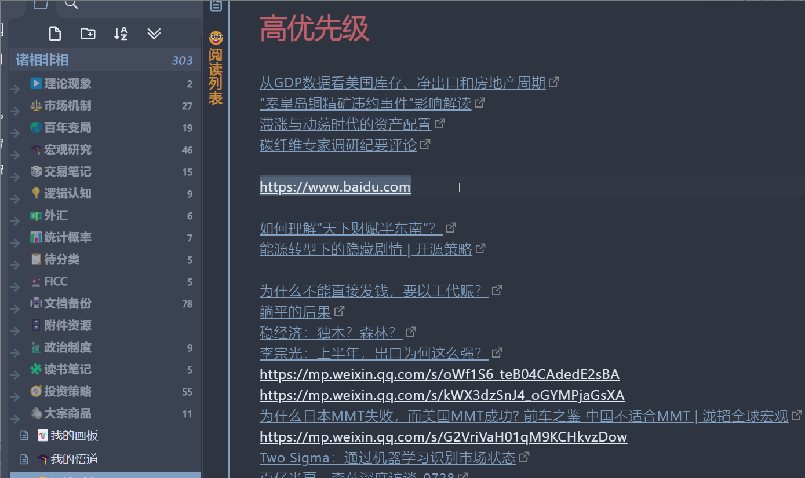

# Obsidian URL Namer

This is a plugin for Obsidian (https://obsidian.md), that retrieves the HTML title to name the unnamed URL link.

## Usage

Select the raw URL text, simply execute "Name the selected URL" command.
Easier if you bind the command to a keyboard shortcut.

## Compilation

- Clone this repo.
- `npm i` or `yarn` to install dependencies
- `npm run build` to compile, or `npm run dev` to start compilation in watch mode.

## Installation

- After compiled, copy over `main.js`, `styles.css`, `manifest.json` to your vault `VaultFolder/.obsidian/plugins/obsidian-url-namer/`.
