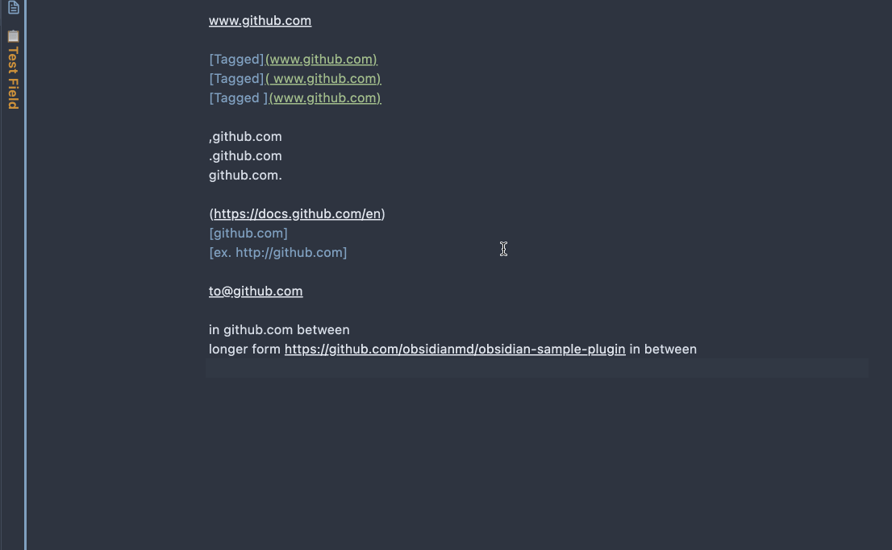

# Obsidian URL Namer

This is a plugin for Obsidian (https://obsidian.md), that retrieves the HTML titles to name the raw URL links.

## Usage

Select the text that contains the URLs to be named, execute the command *Name the URL links in the selected text*.

It's recommended to name few URLs at a time. In the case when the URL requests are taking some time, please **DO NOT** change the text selection or the content itself, before the command is done. Otherwise, the eventual result will be out of order.

Easier with the command binded to a keyboard shortcut.

## Compilation

- Clone this repo.
- `npm i` or `yarn` to install dependencies
- `npm run build` to compile, or `npm run dev` to start compilation in watch mode.

## Installation

- After compiled, rename the `dist` directory to `obsidian-url-namer` and move it into the vault's plugin directory `VaultFolder/.obsidian/plugins/`.

# Customization

Currently the regex for URL matching is hard coded in `main.ts/UrlTagger.rawUrlPattern`. The built-in URL regex pattern can be tested here: https://regexr.com/6rr0c.

By default, the title is got from the `<title>` tag from the HTML source of the URL. However, often times, the content of a page is lazy-loaded, and the title will have to be inferred from the page-load parameters. In such cases, there needs to be site-specific title regex to deal with this.

# Future Development

- Parametrize the URL regex pattern into the plugin settings.
- Parametrize site-specific title regex into the plugin settings.
